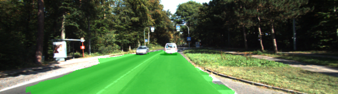

# Semantic Segmentation
In this project I labeled the pixels of a road in images using a Fully Convolutional Network (FCN).
I have used pretrained VGG16 model applied to [Kitti Road dataset](http://www.cvlibs.net/datasets/kitti/eval_road.php).
For better results I have applied some basic data augmentation (flip image, translate, gamma correction).

I have tried some combinations of hyperparameters, number of epochs and batch size. For this GC lower batch size perform better.
With more epoch I got better results. Reasonable good results is with 20 epochs. I laso used L2 regularizer for skip layers and I also added 
weight initialization with normal distribution (stdev=0.01).

As seen on images bellow the results are not perfect but provides reasonable good results.

[image2]: images/umm_000016.png "Image"
[image3]: images/umm_000078.png "Image"
[image4]: images/uu_000021.png "Image"
[image5]: images/uu_000044.png "Image"
[image6]: images/uu_000073.png "Image"
[image7]: images/uu_000090.png "Image"

![alt text][image2]
![alt text][image3]
![alt text][image4]
![alt text][image5]
![alt text][image6]
![alt text][image7]

I have also tried to apply the network to advance line video from Term 1.


##### Dataset
Download the [Kitti Road dataset](http://www.cvlibs.net/datasets/kitti/eval_road.php) from [here](http://www.cvlibs.net/download.php?file=data_road.zip).  Extract the dataset in the `data` folder.  This will create the folder `data_road` with all the training a test images.

##### Run
Run the following command to run the project:
```
python main.py
```
